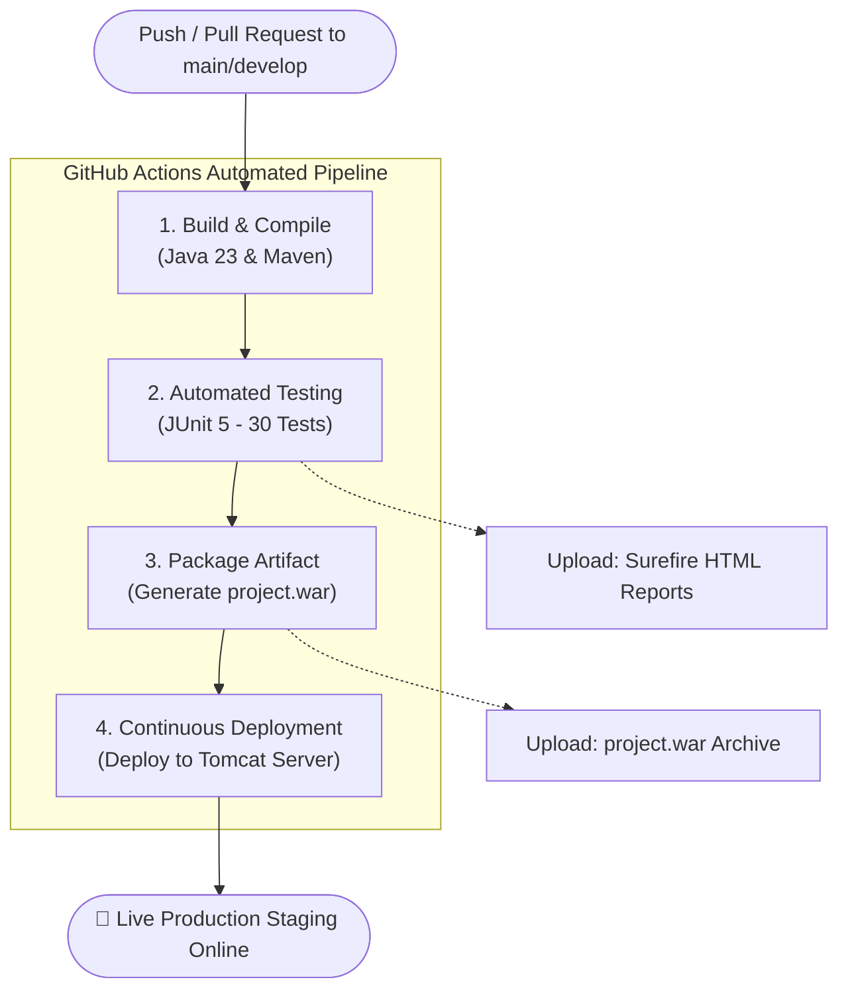

# Task D: Git Version Control & CI/CD Pipeline (CIS6003 - LO III)

**Module:** CIS6003 Advanced Programming  
**Institution:** Cardiff Metropolitan University / School of Technologies  
**Project:** Sunrise Dental Clinic Management System  
**Repository Platform:** Git & GitHub Actions CI/CD  

---

## 1. Version Control Architecture & Branching Strategy

To manage modern, distributed enterprise software delivery, the development follows the **Git Flow** branching and release management standard:

```
                  ┌─────────────────────────────────────────────────────────────┐
                  │                 MAIN BRANCH (Production Ready)              │
                  │   Tag v0.1.0 ────> Tag v0.5.0 ────> Tag v1.0.0 (Release)   │
                  └──────────────▲──────────────────────────────▲───────────────┘
                                 │                              │
                  ┌──────────────┴──────────────────────────────┴───────────────┐
                  │                 DEVELOP BRANCH (Active Integration)         │
                  └──────▲────────────────▲────────────────▲────────────────────┘
                         │                │                │
            ┌────────────┴───┐   ┌────────┴───────┐   ┌────┴───────────┐
            │ feature/models │   │ feature/billing│   │ feature/testing│
            └────────────────┘   └────────────────┘   └────────────────┘
```

### 1.1 Branch Classifications
- `main`: Production-ready branch containing stable, fully tested releases guarded with automated CI/CD branch protection rules.
- `develop`: Integration branch where features are aggregated, validated against unit tests, and packaged.
- `feature/*`: Dedicated topic branches for specific feature implementations (e.g. `feature/billing-strategy`, `feature/rest-servlets`).

---

## 2. Progressive Commit History & Changelog

Development was structured across progressive, semantic commits demonstrating continuous architectural evolution:

| Commit SHA | Tag / Milestone | Commit Message & Engineering Changes |
| :--- | :--- | :--- |
| `cad18e5` | `v0.1.0-alpha` | `feat(init): initialize Maven structure, MySQL schema with triggers/stored procedures, and database config` |
| `f01172b` | `v0.2.0` | `feat(dao): implement domain entities and DAO pattern persistence layer` |
| `6bbfc76` | `v0.3.0` | `feat(service): implement business services, strategy pattern for billing, and observer alerts` |
| `887edc1` | `v0.4.0` | `feat(api): implement distributed REST web service servlets and auth session filter` |
| `d2356e1` | `v0.5.0` | `feat(ui): develop responsive presentation tier, printable invoice receipt, and staff help manual` |
| `b2fdee2` | `v0.6.0` | `test(tdd): create automated JUnit 5 test suite and test plan documentation` |
| `81cec3f` | `v1.0.0` | `ci(pipeline): add GitHub Actions multi-stage CI/CD workflow and UML design diagrams` |

---

## 3. GitHub Actions Continuous Integration & Continuous Deployment (CI/CD)

The automated CI/CD pipeline is defined in [`.github/workflows/ci-cd.yml`](file:///.github/workflows/ci-cd.yml). It triggers automatically on every `push` and `pull_request` to ensure zero-defect integration.

### 3.1 Pipeline Stage Architecture



### 3.2 Pipeline Stage Specifications
1. **Stage 1: Build & Verification**
   - Environment: `ubuntu-latest`
   - Configures Oracle/Temurin JDK 23 with Maven dependency caching.
   - Executes `mvn clean compile -B` to verify compile-time syntactic correctness.
2. **Stage 2: Automated Test Execution (TDD Suite)**
   - Executes `mvn test -B`.
   - Runs all 30 automated test cases across authentication, scheduling, validation, and strategy billing.
   - Publishes test reports via `actions/upload-artifact@v4`.
3. **Stage 3: Package & Release Archiving**
   - Executes `mvn package -DskipTests -B`.
   - Compiles and bundles production web archive (`target/project.war`).
   - Stores deployable package artifact in GitHub Actions repository artifacts.
4. **Stage 4: Automated Deployment & Health Verification**
   - Deploys the `.war` web package into the Tomcat `/webapps` container.
   - Conducts automated health check ping on REST endpoints (`/api/dentists`).

---

## 4. Repository Security, Permissions & Best Practices

1. **Access Restrictions & Branch Protection:**
   - The `main` branch enforces Pull Request reviews and required CI status checks before merging.
2. **Exclusion of Transient / Sensitive Files:**
   - Configured `.gitignore` to strictly exclude compiled binaries (`.class`, `target/`), local server temporary files, IDE metadata (`.idea`, `.vscode`), and operating system artifacts.
3. **Reproducible Builds:**
   - Standardized Maven `pom.xml` configuration with pinned plugin and dependency versions guaranteeing identical builds on any machine.
