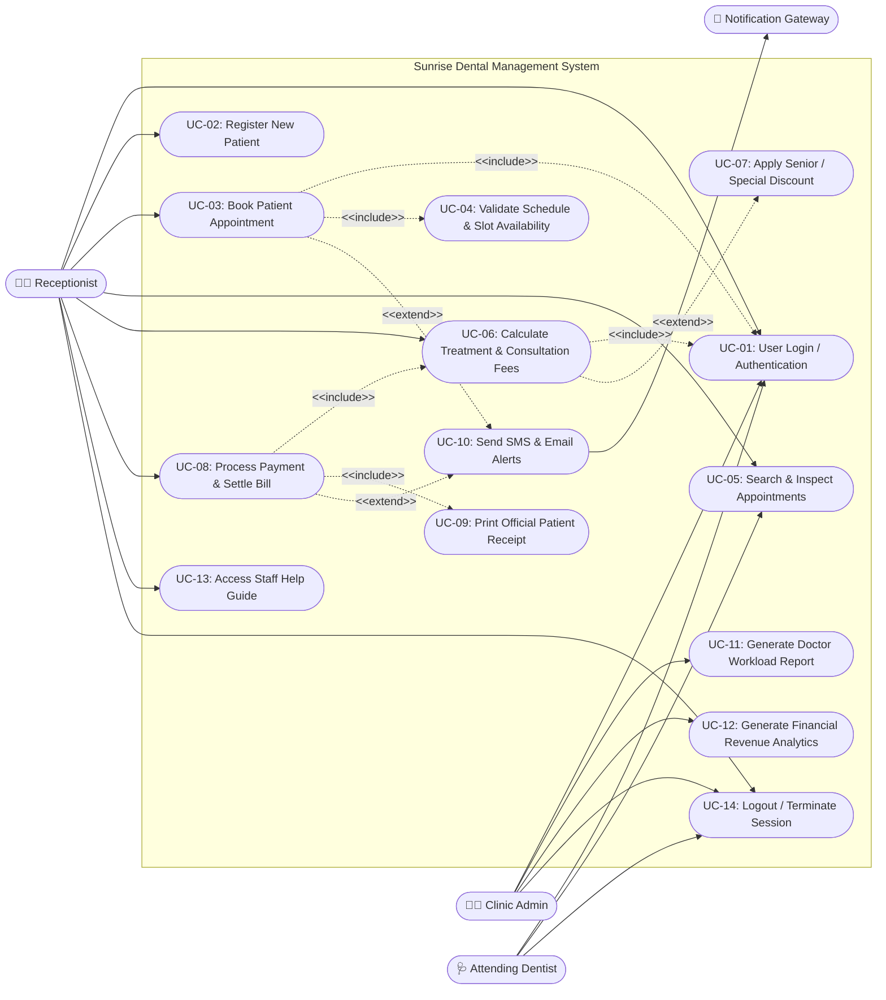
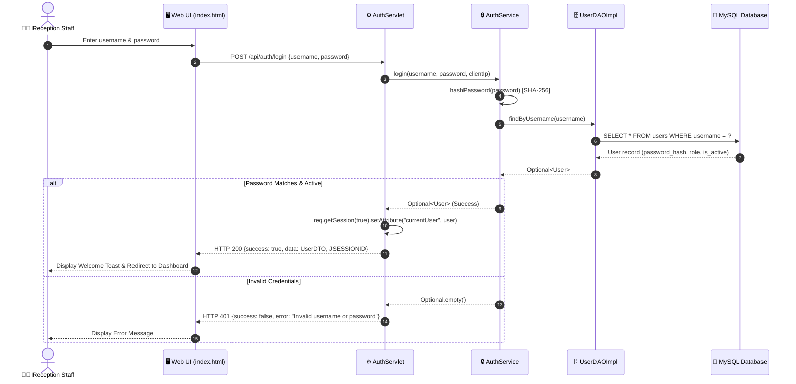
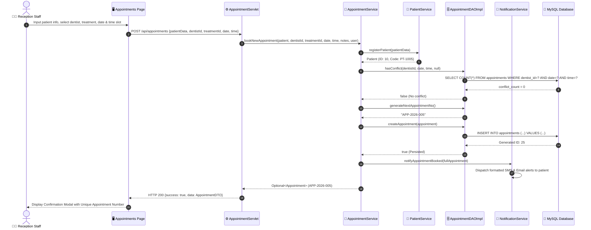
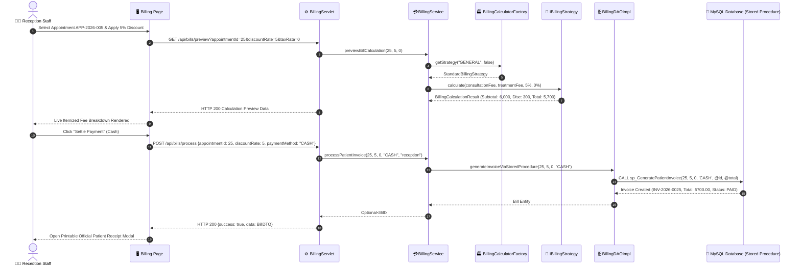

# Task A: System Design & UML Diagrams (CIS6003 - LO I)

**Module:** CIS6003 Advanced Programming  
**Institution:** Cardiff Metropolitan University / School of Technologies  
**Project:** Sunrise Dental Clinic Management System  
**Author:** Software Engineering Team  

---

## 1. System Design Rationale & Architectural Decisions

Sunrise Dental Clinic is a busy private dental practice based in Colombo, Sri Lanka. Previously reliant on manual paper files and physical logbooks, the clinic suffered from frequent scheduling double-bookings, misplaced treatment histories, billing calculation errors, and slow administrative throughput. 

To overcome these challenges, an enterprise-grade **Distributed Three-Tier Architecture** has been engineered:
1. **Presentation Tier:** A responsive, accessible Single-Page/Multi-View client interface built with modern semantic HTML5, CSS design tokens, and asynchronous JavaScript (Fetch API).
2. **Business Logic Tier:** A modular Java EE / Jakarta RESTful Web Service layer incorporating enterprise **Design Patterns** (Singleton, Factory, Data Access Object, Strategy, Observer, MVC) to enforce business rules, transaction safety, and role-based security.
3. **Data Access Tier:** Relational MySQL/MariaDB database management system augmented with integrity constraints, **Triggers** (preventing doctor double-booking), **Stored Procedures** (transactional invoice generation), and **Stored Functions** (aggregate revenue analytics).

---

## 2. Use Case Diagram (with `<<include>>` and `<<extend>>` Stereotypes)

### 2.1 Use Case Specifications
- **Primary Actors:**
  - `Receptionist / Front Desk Staff`: Registers patients, books appointments, inspects appointment details, collects payments, and issues receipts.
  - `Clinic Director / Admin`: Views executive financial metrics, doctor workload performance reports, audits system activity, and manages system users.
  - `Dentist / Clinical Doctor`: Views assigned patient schedule, examines clinical records, and marks treatments completed.
- **Secondary Actor:**
  - `Notification Service (SMS/Email Gateway)`: Dispatches automated appointment reminders and payment confirmations.

### 2.2 Mermaid Use Case Diagram

---

## 3. Comprehensive Class Diagram

The class diagram encapsulates complete object-oriented attributes, private/public visibility modifiers (`-`, `+`, `#`), method signatures, parameter types, return types, multiplicities, and relationships (**Composition**, **Aggregation**, **Generalization**, and **Dependency**).

```mermaid
classDiagram
    %% Singleton Database Connection
    class DatabaseConnection {
        -static DatabaseConnection instance
        -HikariDataSource dataSource
        -DatabaseConnection()
        +static DatabaseConnection getInstance()
        +Connection getConnection()
        +DataSource getDataSource()
        +void closePool()
    }

    %% Domain Models
    class User {
        -int id
        -String username
        -String passwordHash
        -String fullName
        -String role
        -String email
        -boolean active
        -Timestamp createdAt
        +getId() int
        +getUsername() String
        +getPasswordHash() String
        +getRole() String
    }

    class Patient {
        -int id
        -String patientCode
        -String fullName
        -String address
        -String contactNo
        -String email
        -Date dob
        -String gender
        +getId() int
        +getPatientCode() String
        +getFullName() String
        +getContactNo() String
    }

    class Dentist {
        -int id
        -String name
        -String specialization
        -String roomNo
        -String contactNo
        -String email
        -BigDecimal consultationFee
        -boolean available
        +getId() int
        +getName() String
        +getConsultationFee() BigDecimal
    }

    class Treatment {
        -int id
        -String treatmentCode
        -String name
        -String description
        -BigDecimal standardFee
        -String category
        +getId() int
        +getTreatmentCode() String
        +getStandardFee() BigDecimal
    }

    class Appointment {
        -int id
        -String appointmentNo
        -int patientId
        -int dentistId
        -int treatmentId
        -Date appointmentDate
        -Time appointmentTime
        -String status
        -String notes
        +getAppointmentNo() String
        +getStatus() String
    }

    class Bill {
        -int id
        -String billNo
        -int appointmentId
        -BigDecimal consultationFee
        -BigDecimal treatmentCost
        -BigDecimal discountRate
        -BigDecimal discountAmount
        -BigDecimal taxRate
        -BigDecimal taxAmount
        -BigDecimal totalAmount
        -String paymentStatus
        -String paymentMethod
        -Timestamp billDate
        +getBillNo() String
        +getTotalAmount() BigDecimal
    }

    %% Strategy Pattern Hierarchy
    class IBillingStrategy {
        <<interface>>
        +calculate(BigDecimal consult, BigDecimal treat, BigDecimal disc, BigDecimal tax) BillingCalculationResult
        +getStrategyName() String
    }

    class StandardBillingStrategy {
        +calculate(BigDecimal consult, BigDecimal treat, BigDecimal disc, BigDecimal tax) BillingCalculationResult
        +getStrategyName() String
    }

    class SeniorDiscountBillingStrategy {
        -static BigDecimal SENIOR_BASE_DISCOUNT
        +calculate(BigDecimal consult, BigDecimal treat, BigDecimal disc, BigDecimal tax) BillingCalculationResult
        +getStrategyName() String
    }

    class SurgicalBillingStrategy {
        -static BigDecimal SURGICAL_STERILIZATION_SURCHARGE
        +calculate(BigDecimal consult, BigDecimal treat, BigDecimal disc, BigDecimal tax) BillingCalculationResult
        +getStrategyName() String
    }

    class BillingCalculatorFactory {
        +static IBillingStrategy getStrategy(String category, boolean isSenior)
    }

    %% Data Access Interfaces & Implementations
    class IAppointmentDAO {
        <<interface>>
        +createAppointment(Appointment app) boolean
        +findById(int id) Optional~Appointment~
        +findByAppointmentNo(String no) Optional~Appointment~
        +hasConflict(int dentistId, Date d, Time t, Integer exclId) boolean
    }

    class AppointmentDAOImpl {
        -static Logger LOGGER
        +createAppointment(Appointment app) boolean
        +findByAppointmentNo(String no) Optional~Appointment~
    }

    class IBillingDAO {
        <<interface>>
        +createOrUpdateBill(Bill bill) boolean
        +generateInvoiceViaStoredProcedure(int appId, BigDecimal disc, BigDecimal tax, String method) Optional~Bill~
        +calculateTotalRevenue(Date start, Date end) BigDecimal
    }

    class BillingDAOImpl {
        -static Logger LOGGER
        +generateInvoiceViaStoredProcedure(int appId, BigDecimal disc, BigDecimal tax, String method) Optional~Bill~
    }

    %% Service Layer
    class AppointmentService {
        -IAppointmentDAO appointmentDAO
        -IPatientDAO patientDAO
        -IDentistDAO dentistDAO
        -ITreatmentDAO treatmentDAO
        +bookNewAppointment(Patient p, int dId, int tId, Date d, Time t, String notes, String user, StringBuilder err) Optional~Appointment~
        +searchByAppointmentNo(String no) Optional~Appointment~
    }

    class BillingService {
        -IBillingDAO billingDAO
        -IAppointmentDAO appointmentDAO
        +previewBillCalculation(int appId, BigDecimal disc, BigDecimal tax, StringBuilder err) BillingCalculationResult
        +processPatientInvoice(int appId, BigDecimal disc, BigDecimal tax, String method, String user, StringBuilder err) Optional~Bill~
    }

    class NotificationService {
        -static List~String~ NOTIFICATION_DISPATCH_LOG
        +static void notifyAppointmentBooked(Appointment app)
        +static void notifyInvoicePaid(Bill bill)
    }

    %% Relationships
    IBillingStrategy <|.. StandardBillingStrategy : implements
    IBillingStrategy <|.. SeniorDiscountBillingStrategy : implements
    IBillingStrategy <|.. SurgicalBillingStrategy : implements
    BillingCalculatorFactory ..> IBillingStrategy : creates

    IAppointmentDAO <|.. AppointmentDAOImpl : implements
    IBillingDAO <|.. BillingDAOImpl : implements

    AppointmentService o-- IAppointmentDAO : aggregation
    AppointmentService ..> NotificationService : triggers
    BillingService o-- IBillingDAO : aggregation
    BillingService ..> BillingCalculatorFactory : uses

    Patient "1" *-- "0..*" Appointment : has
    Dentist "1" -- "0..*" Appointment : conducts
    Treatment "1" -- "0..*" Appointment : specifies
    Appointment "1" *-- "0..1" Bill : generates
    AppointmentDAOImpl ..> DatabaseConnection : retrieves connection
    BillingDAOImpl ..> DatabaseConnection : retrieves connection
```

---

## 4. Sequence Diagrams (Key Business Scenarios)

### Scenario 1: Staff Authentication & Session Login

### Scenario 2: Register New Patient & Schedule Appointment (with Conflict Validation & Observer Notification)

### Scenario 3: Fee Calculation (Strategy Pattern) & Invoice Receipt Settlement

---

## 5. Critical Evaluation of System Design

1. **Coupling & Cohesion:** By decoupling the business layer from the presentation layer using REST endpoints, client UI modifications do not impact server business logic.
2. **Extensibility via Design Patterns:**
   - Introducing a new billing scheme (e.g. Corporate Insurance or Student Discount) requires only creating a new class implementing `IBillingStrategy` without modifying existing calculation engines (adhering to the **Open/Closed Principle**).
   - Adding alternative database persistence targets (e.g. PostgreSQL or MongoDB) is achieved seamlessly via `DAOFactory` and DAO interfaces.
3. **Transactional Integrity & Concurrency:** Utilizing database triggers and stored procedures guarantees ACID compliance and eliminates race-condition double bookings even during simultaneous client requests.
